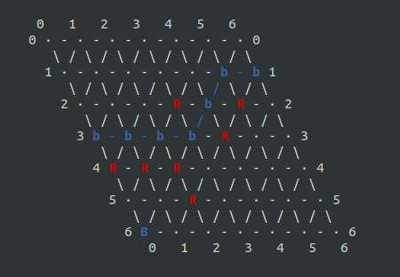
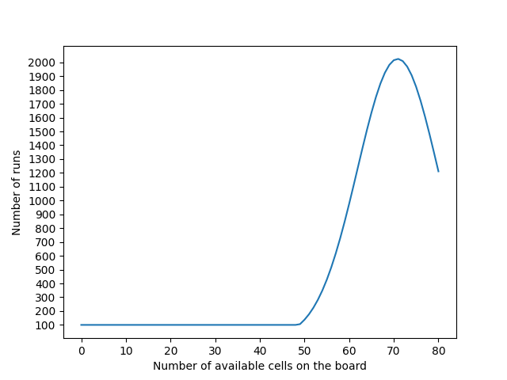

# Hex_game_AI
This depository contains some code I wrote for the course [C++ For C Programmers, Part B](https://www.coursera.org/learn/c-plus-plus-b) delivered by the University of California Santa Cruz on Coursera.

The purpose is to implement the [Hex game](https://en.wikipedia.org/wiki/Hex_(board_game)) where two human players can play against each other or a human plays against the machine or the machine plays against itself.

For the machine to play, I implemented 3 methods in what I call machine engines.  
The engines are named:
- `HexMachineDummy`
- `HexMachineBF`  
- `HexMachineMcIA`

> Examples are given in `main.cpp` on how to select the machine engine(s).

I will explain each of them below in the **Code explanations** section.

## Compilation
### Clean
```bash
make clean
```
### Build
```bash
make
```
### Options
In the Makefile:  
If you wish to use ncurses instead of the default terminal uncomment the lines  
```bash
#CPPFLAGS += -D_NCURSES  
and   
#LIBS += -lncurses  
```

Here are examples of 6x6 boards at the end of some games without and with ncurses.

#### Without ncurses
```text
Blue Player won! (the b's show the winning path)
   0   1   2   3   4   5   6
 0 R - B - B - R - R - b - b 0
    \ / \ / \ / \ / \ / \ / \
   1 R - B - B - R - b - R - . 1
      \ / \ / \ / \ / \ / \ / \
     2 B - . - R - R - b - R - R 2
        \ / \ / \ / \ / \ / \ / \
       3 R - . - b - b - R - B - R 3
          \ / \ / \ / \ / \ / \ / \
         4 . - b - . - . - R - . - B 4
            \ / \ / \ / \ / \ / \ / \
           5 . - b - R - B - R - B - R 5
              \ / \ / \ / \ / \ / \ / \
             6 b - . - R - R - . - B - B 6
                0   1   2   3   4   5   6
```

#### With ncurses


> **Note**:
The code for the **User Interface** is in `hex_ui.h`.


## To play
> See examples of setting in `main.cpp`.  

Call `./hex` once compilation is done.  
You will be invited to enter the size of the board, the number of human player and your color if you want to play against the machine.  
Below is an example.
```text
./hex 

*** Welcome to the Hex Game! ***
Enter the board's size (just press enter for the default value of 7):

Enter the number of human players (0, 1 or 2)
(just press enter for the default value of 0):
1
   0   1   2   3   4   5   6
 0 . - . - . - . - . - . - . 0
    \ / \ / \ / \ / \ / \ / \
   1 . - . - . - . - . - . - . 1
      \ / \ / \ / \ / \ / \ / \
     2 . - . - . - . - . - . - . 2
        \ / \ / \ / \ / \ / \ / \
       3 . - . - . - . - . - . - . 3
          \ / \ / \ / \ / \ / \ / \
         4 . - . - . - . - . - . - . 4
            \ / \ / \ / \ / \ / \ / \
           5 . - . - . - . - . - . - . 5
              \ / \ / \ / \ / \ / \ / \
             6 . - . - . - . - . - . - . 6
                0   1   2   3   4   5   6
Select your color (Blue starts)
Blue enter 0, Red enter 1

```
Below is a screen record of a party on a 9x9 board with the machine playing against itself with the 2 engines being objects of type `HexMachineMcIA`.  


## Code explanations
The code for the colored graph I use in this project can be found in my repository [Undirected-Graph-Algorithms](https://github.com/CL-BZH/Undirected-Graph-Algorithms).  

  
The file `hex.h` contains the class `Hex` that is the entry point for running the Hex game.  
As can be seen in `main.cpp`, to instantiate an `Hex` object one must provide an `HexBoard` object and an `HexMachineEngine` object *(see explanations below)*.  
There can be 0, 1 or 2 human players.  
The method `prompt_player()` is called when it is the turn of the *(blue or red)* human player to play.
The method `machine_play()` is called when it is the turn of the *(blue or red)* machine player to play.

The `HexBoard` class is defined in the file `hex_board.h` and the `HexMachineEngine` class is defined in the file `hex_machine_engine.h`.  
The `HexBoard` object is in charge of the board for the Hex game.
Some of the main methods are:
- `select()`
- `draw_board()`
- `has_won()`

*(there are some more helper functions)*  

`select()` is in charge of the reservation of a cell on the board. It will prompt the player to select a position until she/he selects an empty cell on the board.  
`draw_board()` is in charge of drawing the board on the terminal.  
`has_won()` control if the current player built a path from one side to the other. It uses the Dijkstra shortest path algorithm implemented in `shortest_path.h`. The algorithm is ran on a colored graph that represents the board.  
> Explanation on why I use a shortest path algorithm to find a winner will be given below.  

The `HexMachineEngine` class is the interface for machine engines.  
All machine engines inherit from `HexMachineEngine` and they define the algorithms that the **machine player** (i.e. the computer)  uses to play the game. So far there are three engines:
- `HexMachineDummy`
- `HexMachineBF`
- `HexMachineMcIA`

`HexMachineDummy` implements the 'dummy' machine where positions on the board are randomly chosen.  

`HexMachineBF` is the 'Brute-Force' engine. This one should be used only on small boards or once there is only few avalaible cells on the board.  
*(e.g. On a 8 cores' computer selecting the first
position of a 5x5 board would take about 12 minutes, and about 5 minutes for the second position)*  
> **How it works**:  
The 'Brute-Force' engine generates all the possible states of a given board.  
That is, if there are `n` available cells on the board then all combinations of `k` cells to be given to the current player will be generated. With  
    <!-- $k = {\lfloor}{\frac{(n+1)}{2}}{\rfloor}$ --> .  
For each combination, the cells that were not selected are given to the opponent.  
Then each cell is given a `quality` score that is the sum of `quality` scores obtained from each combination.  
**For one combination**, the `quality` is set to 0 if there is no path connecting the 2 edges otherwise it is equal to the sum of the inverse of the lenght of shortest path(s) that connect two opposite edges *(see `has_won()` in `hex_board.h` )*.  
Let's take an example.  
Suppose it is the turn of the **Red** machine to play and that for the a given combination there is no path going from **North** to **South** *(then there is necessarily at least one path from **West** to **East** for the **Blue** machine)*. Then the `quality` of that combination for the **Red** player is 0 and for the **Blue** player it is the sum of the inverse of the lenght of shortest path(s) that connect **West** to **East**, let's call it `opponent_quality`. *(see `bf_task()` in `hex_machine_engine.h`)*  
Then, for that combination, the `quality` score given to each available cell is `0 - opponent_quality`.  
Then, the summing for each available cell the `quality` obtained by each combination gives its final `quality` score and the one with the best one is selected for the current *(machine)* player.  
As can be seen in `task_bf()` there is a special case indicated by the boolean `game_over`. If for a combination there is a path from one side to the other that can be built by adding only one cell to the current state then the quality is set to the maximum so that this *missing* cell is selected by the *(machine)* player.  
...  
Now, let me explain how the combinations are generated.  
First of all, the work is splitted among the threads (by default the number of threads is set equal to the number of core).  
Let's say we have `T` threads. Then `T-1` threads are given an element and build combinations by selecting `k-1` elements among the not yet given elements. The `T`th thread will then generate combinations by selecting `k` elements among the not given elements. Let's take an example.  
Suppose we have **3** threads and that the indexes of the available cells are `[11, 17, 33, 37, 45]` then we need to generate all combinations of `k=3` of these indexes *(`k=[(5+1)/2]`)* .  
Thread '1' is given the element `[11]` and will generate all combinations of 2 elements from `[17, 33, 37, 45]`.  
So, thread '1' will generate the combinations:  
`[11, 17, 33]`, `[11, 17, 37]`, `[11, 17, 45]`, `[11, 33, 37]`, `[11, 33, 45]`, `[11, 37, 45]`.  
Thread '2' is given the element `[17]` and will generate all combinations of 2 elements from `[33, 37, 45]`.  
So, thread '2' will generate the combinations:  
`[17, 33, 37]`, `[17, 33, 45]`,`[17, 37, 45]`.  
Finally, thread '3' will generate all combinations of 3 elements among `[33, 37, 45]`. Hence it generate the combination `[33, 37, 45]`.  
Each thread uses the function `n_choose_k()` wich is a recursive function that generates the combinations. Once a combination is ready it calls `bf_task()`.  


Let's focus now on the engine `HexMachineMcIA`.  
`HexMachineMcIA` uses Monte-Carlo simulation to decide which move is the best for a given state of the board.  
The total number of trials for the Monte-Carlo simulation is evenly distributed between threads (see `HexMachineMcIA::spawn_threads()`) 
> *The number of threads can be selected and it is by default equal to the number of core.*   

The task performed by each thread is implemented in `mc_task()` *(in `hex_machine_engine.h`)*  

> **How it works**  
First `get_position()` is called to get a best candidate for the board's cell to be selected.  
So, in `get_position()` a list of all available cells is created.  
Then for each of these available positions do:  
> * select that position
> * if this position creates a winning path *(i.e. a path from **West** to **East** if the machine player is **Blue** or a path from **North** to **South** if the machine player is **Red**)* then return that position as the best cell to select.
> * else, spawn threads to obtain a quality score *(explained below)* for that position.
> * release the position
> * compute the estimated probability of winning if that position is selected for next move.
> * store the position in a priority queue with the one with the highest probability coming first.  

> Let's detail how the quality of a move is computed in `mc_task()` that each thread calls.  
So, each thread will perform a certain number of trial where each trial consist in:
> * fill the board by randomly distibuting between the *Red* and *Blue* players the remaining free positions *(i.e. all available positions minus the one that is selected for evaluation)*    
> * check if the current player wins
>> * if it wins then the selected position get a quality score given by the sum of the inverse of the length of all shortest paths. And the opponent quality score for that position is 0
>> * otherwise the quality score of that position is 0 and since it necessarily means that the opponent wins we obtain the quality score for the opponent *(sum of the inverse of the length of all shortest paths for the opponent)*

> Once all threads finished, the average quality score for the position is computed.  
So, a position has 2 average scores, the one for the current player and the one for the opponent.  
Then, the estimate probability of winning for a position is given by the ratio:  
> <!-- $\frac{average\_quality\_score\_for\_current\_player}{ average\_quality\_score\_for\_current\_player + average\_quality\_score\_for\_opponent}$ -->    

> The position is stored in a priority queue and the one with the highest probability of winning will be selected for the *(machine)* player's next move.  

> **Note**:  
There is an option to switch to **brute-force** once the number of free positions is below a certain limit.  
The flag to set in the Makefile is `_BF_SUP`.  
`CPPFLAGS += -D_BF_SUP=20` means that the brute-force algorithm will be run once the number of available cells on the board is less than 20.

> A bit of explanation on how is decided the number of runs for the Monte-Carlo simulation.  
This is computed in `get_number_runs()` *(hex_machine_engine.h)*.
The number of runs is based on the size of the board, the number of available cells and a factor `max_runs_factor` that is defined as a `static constexpr` in the class `HexMachineMcIA`. 
The function is reproduced in the `Python` script `bell_curve.py` that is in the `Tools` directory.  
Below is the curve that represent the number of runs for a 9x9 board with `max_runs_factor = 25`.
  
So, the minimum number of runs is set to 100 *(normally the game finishes before the number of available cells is less than 50)*.
The computation load (i.e. the number of runs per position) is maximum when there are already some cells selected and we want a maximum of 'reliability' on the cell selection process.

----
## To Do
Build a Reinforcement Learning solution...